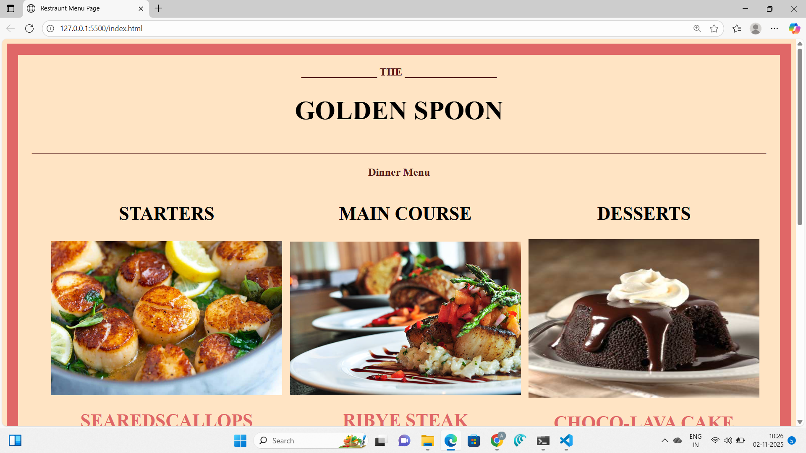
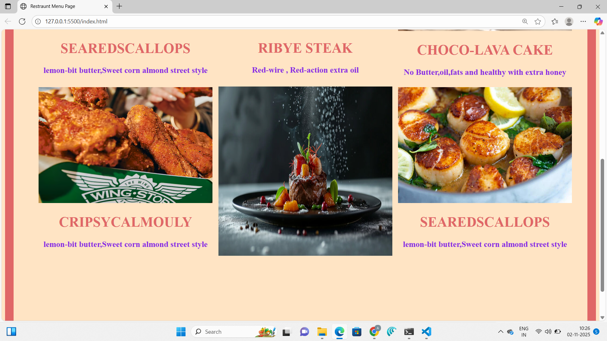

# 🍽️ Restaurant Menu Website

A **modern, responsive Restaurant Menu** website built using **HTML, CSS, and JavaScript**.  
This project displays a clean and interactive menu layout where users can explore dishes by category, view prices, and enjoy a beautiful food-themed design.  

## 🌟 Features

- 🧾 **Dynamic Menu Layout:** Organized food items (Starters, Main Course, Desserts, Beverages, etc.) with descriptions and prices.  
- 📱 **Fully Responsive:** Works seamlessly on all devices — from desktop to mobile.  
- 🎨 **Attractive UI:** Elegant typography, smooth hover effects, and a color palette that enhances the dining experience.  
- 🕹️ **Filter Options (if added):** Filter food items by category using buttons or tabs.  
- 🌈 **Animations & Hover Effects:** Engaging CSS transitions for a smooth browsing experience.  
- 🔍 **Search Bar (optional):** Quickly find your favorite dishes.  

---

## 🛠️ Tech Stack

- **HTML5** — For the structure  
- **CSS3** — For styling, grid/flex layouts, and responsive design  
- **JavaScript** — For interactivity (filtering, searching, animations)

---

## 📸 Screenshots

### 🧭 Homepage

### 📋 Menu Section

---

## 🚀 Live Demo

👉 **[View Demo](http://127.0.0.1:5500/index.html)**  

---

## 🧩 Folder Structure
restaurant-menu/
│
├── index.html
├── style.css
├── script.js
├── images/
│ ├── dish1.jpg
│ ├── dish2.jpg
│ └── ...
└── screenshots/
├── homepage.png
└── menu-section.png

---

## 💡 Learning Highlights

- Mastered CSS Grid/Flexbox for layout design  
- Improved understanding of responsive web design principles  
- Enhanced interactivity using DOM manipulation in JavaScript  
- Practiced creating aesthetically pleasing, real-world UI components  

---

## 🧑‍🍳 Future Enhancements

- 🛒 Add “Add to Cart” functionality  
- 💳 Integrate online ordering/payment system  
- 🌐 Connect to a backend for dynamic data  
- 🌙 Add Dark/Light mode toggle  

---

## 🤝 Connect with Me

💼 [LinkedIn](https://www.linkedin.com/in/yourprofile)  
🐙 [GitHub](https://github.com/ankithakanneboina)

---

### 🏁 Conclusion

This **Restaurant Menu Website** is a front-end project demonstrating modern web design practices, responsive UI, and interactivity — a great fit for showcasing your front-end development skills to recruiters and hiring managers.

